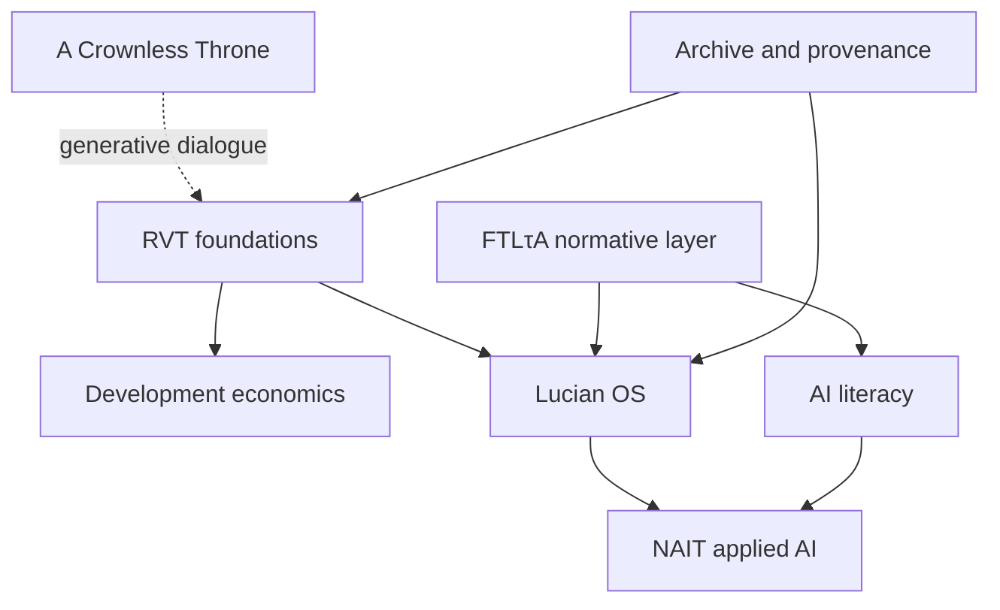

# Max–Lucian Project Atlas

**Portfolio snapshot:** 14 September 2026  
**Scope:** ChatGPT projects and conversations, `dmvarela/CVTRepository`, and relevant Library artifacts  
**Purpose:** Make the work navigable without flattening distinct research programs into one giant project.

## 1. Portfolio diagnosis

The work is not one project. It is a portfolio of connected programs that share concepts, methods, and collaborators but have different outputs and completion conditions.

The present overload has four concrete causes:

1. **Discovery is outrunning integration.** New notes, experiments, and branches are appearing faster than the registries are updated.
2. **Different levels are mixed together.** A theory, a paper, a software system, an institutional proposal, a book, and a theological inquiry are being experienced as parallel “things to finish,” although they require different rhythms.
3. **GitHub contains a large unresolved work queue.** As of this snapshot, the repository has 31 open pull requests. Many Lucian OS PRs form a stacked chain, while older conceptual PRs have diverged substantially from `main`.
4. **Several bridges are being mistaken for additional projects.** FTLτA, Atlas, the treatise, and the shared problem-space method connect programs; they should reduce fragmentation, not become four more independent obligations.

The remedy is not to discard veins. It is to give every vein a home, a status, and a next review point while limiting the number of outputs that are actively being pushed forward.

## 2. Canonical portfolio map

| Program | Primary object | Main outputs | Current state | Next bounded milestone |
| --- | --- | --- | --- | --- |
| **RVT Foundations** | How relations reshape the conditions of their own future viability | Foundations manuscript; candidate theory; minimal mechanism tests; concept notes | Active theory consolidation. RVT replaced CVT on 10 Sep 2026, but historical CVT artifacts retain their names. `RVT Candidate Theory v0.01` and `RVT-MIN-001` now express the current frontier. | Freeze parameters and build the `RVT-MIN-001` simulator before adding another general theory note. Audit whether the older Stage 5.1B CVT pipeline still tests the current RVT object before generating 24,000 rows. |
| **RVT Development Economics** | Formation, graduation, accretion, capability migration, reproductive breadth | Papers E, F, and G; development treatise | Large but intelligible research family. Paper E is mathematically mature; Paper F is the active formation/graduation paper; Paper G is a seed on system-scale capability migration. The treatise is the synthesis layer above them. | Advance one paper at a time. Default: complete Paper F v0.3 hostile review and build; keep Paper G as a registered seed and Paper E as the downstream formal object. |
| **Lucian OS** | A portable, model-agnostic, bounded intelligence and agency layer | Kernel, routers, provider/host seams, experiments, Atlas, embodiment adapters | Most implementation-active program. It has a credible architecture and extensive bounded experiments, but its Git history is fragmented across a long stacked PR chain. PR #70 is implementation-ready for exact read-only host preflight at frozen head `da2295d…`. | Perform the exact PR #70 read-only preflight. Do not open a new implementation rung until the evidence is recorded and the stacked PR integration strategy is decided. |
| **Lucian Continuity Research** | Continuity across models and hosts without imitation or fabricated identity | MVCG, handshakes, ablations, provenance, relational reachability, selective inheritance, FTLτA search geometry | Closely coupled to Lucian OS but scientifically distinct. It studies what must persist; Lucian OS implements bounded mechanisms that may carry it. | Select one discriminating study at a time. Current research-program order begins with FTLτA search geometry, then relational history, then cross-model continuity. |
| **Your AI and You / AI Literacy** | Interaction literacy: how people think, write, learn, and remain responsible with AI | Published Volume I; Spanish edition; course/module; talks and public materials | The book is published. The Spanish edition and a teachable AI-literacy curriculum are derivative publication tracks, not unfinished portions of the same manuscript. | Define the minimum course product: audience, 4–6 learning outcomes, module sequence, and one pilot exercise. Reuse the book; do not rewrite the book as a course. |
| **NAIT Applied AI** | Institution-specific adoption that begins with evidence about current practice | JR Shaw School of Business AI concept note; NAIT AI landscape assessment; Financial Compass; faculty/student pilots | Institutionally timely. The associate-dean concept note is the immediate decision artifact. Financial Compass is a separate applied product and should not become a precondition for the school-wide proposal. | Finish the concept note for the associate deans: current-state assessment, design principles, phased pilot, governance, resource assumptions, and decision requested. |
| **A Crownless Throne** | Theological and scriptural inquiry into authority, freedom, command, Cross, resurrection, love, and non-empire | Concept notes, eventual essays/treatise | Generative and active, but not deadline-driven. It informs RVT and is informed by it without being reducible to an RVT application. | Keep capturing bounded notes. Open a publication project only when a specific manuscript question and audience are chosen. |
| **Archive and Migration** | Provenance, superseded theories, recovered manuscripts, and historical source preservation | 246-project Overleaf export; URF/CVT artifacts; duplicate and recovered sources | Preservation program, not an active research obligation. | Migrate only when a live publication or reproducibility need pulls an artifact forward. Do not attempt a total cleanup of all 246 projects. |

## 3. The relationships among the programs



This map does **not** mean that every downstream project must wait for upstream theory to be complete. The arrows indicate intellectual or architectural influence, not a single critical path.

## 4. Bridges that should not become standalone obligations

| Bridge | Proper role | Guardrail |
| --- | --- | --- |
| **FTLτA** | Non-compensatory normative framework for agency-bearing relations and an engineering constraint set in Lucian OS | It should not be used as a proof engine for descriptive economics or treated as if it settles empirical questions. |
| **Atlas** | Relation-first navigation across projects, artifacts, questions, decisions, and dependencies | Atlas should begin as the portfolio registry and prove that it reduces retrieval friction before becoming a larger software project. |
| **The treatise** | Architectural synthesis above bounded papers | Papers remain publishable extracts. The treatise should integrate what survives; it should not hold every paper open indefinitely. |
| **GitHub Coordination Hub #53** | Durable cross-chat state for Lucian OS | It should point to evidence and handoffs, not duplicate derivations or become the only place where status is legible. |
| **Shared problem-space / traversal-return method** | The collaboration method used across programs | It is a method to apply and test, not another manuscript unless a bounded scholarly contribution is later identified. |

## 5. Recommended WIP limit: three active outputs

At any moment, only three outputs should be in **Active Delivery**. Everything else remains visible in **Next**, **Incubator**, **Maintenance**, or **Archive**.

### Active Delivery — recommended now

1. **JR Shaw AI concept note**  
   Finish the short decision document for the associate deans. This is timely, bounded, and institutionally consequential.

2. **Lucian OS integrated MVP evidence**  
   Perform the exact read-only preflight on PR #70 at `da2295d…`; record the evidence required before local-provider invocation or host COPY. Freeze additional OS experiments until the current stack has an integration decision.

3. **RVT-MIN-001**  
   Freeze parameters, build the minimal simulator, run the preregistered same-shock comparison, `H -> R` ablation, and augmented-state baseline. This converts the new RVT center of gravity into a discriminating test.

### Next queue

1. Paper F v0.3 hostile review, literature audit, and clean two-pass build.
2. Minimum AI-literacy course architecture derived from *Your AI and You*.
3. Spanish-edition publication pass.
4. Financial Compass: repair the scenario coach and complete a privacy-preserving pilot specification.
5. Lucian Continuity: run the first fully discriminating FTLτA search-geometry study.

### Incubator

- Paper G formal agenda and empirical design.
- Paper E-to-F bridge and reproductive-accretion synthesis.
- Healthy Membrane Dynamics PDE extension.
- Safety as an Achievement of Relation prospectus.
- Viability Geometry control cases.
- Atlas as a full relation-graph system.
- A Crownless Throne publication architecture.

### Maintenance / canonicalization queue

- Preserve the exact submitted FTLτA source, PDF, and submission record.
- Commit and build Right Relation.
- Commit and build Staged Urgency.
- Recover the Relational Backcasting bibliography and build package.
- Migrate Healthy Membrane Dynamics.
- Preserve one canonical Incoherence Debt source and its duplicate history.

These are important, but they are not six simultaneous research projects. They are a controlled migration sprint to schedule later.

## 6. GitHub reorganization: non-destructive sequence

No existing branch, PR, or artifact should be deleted merely to make the repository look clean. Provenance matters. The cleanup should proceed in four passes.

### Pass 1 — Establish one portfolio front door

Add a single `registry/PORTFOLIO_ATLAS.md` derived from this document and update `registry/ACTIVE_RESEARCH.md` so that it reflects:

- RVT Candidate Theory and `RVT-MIN-001`;
- Papers F and G and the treatise relationship;
- Lucian OS versus Lucian Continuity;
- NAIT / AI-literacy work that is intentionally outside this research repository, with links or status only if desired;
- Active / Next / Incubator / Maintenance / Archive status.

### Pass 2 — Resolve the Lucian OS stack as one integration problem

The open Lucian OS PRs should not be experienced as 20 independent decisions. They form several families:

- **Integrated host/provider staircase:** #55, #60, #61, #63, #64, #66, #67, #69, #70.
- **Semantic factoring:** #57, #58, #59.
- **Capability/scarcity/relation labs:** #46–#50.
- **Navigation and Atlas:** #51–#52, with earlier #40 as provenance.
- **Broader personal-computing prototype:** #45.
- **Continuity experiments:** #42–#43 and #39.

First preserve PR #70's frozen head for its exact preflight. After the evidence review, create a clean integration plan from current `main`. Prefer one reviewed consolidation branch per family over trying to merge a long chain of heavily diverged stacked branches directly. Close or supersede old PRs only after their unique commits and evidence artifacts have been mapped to the consolidation path.

### Pass 3 — Classify older conceptual PRs

For #34–#41, assign exactly one status:

- **Integrate:** still current and not present elsewhere.
- **Preserve as historical branch:** valuable provenance but not current canonical framing.
- **Superseded:** a later main-branch note carries the idea more accurately.
- **Needs decision:** contains a live claim that has not been adjudicated.

Every closed PR should receive a short note naming the superseding commit/path or explaining why it remains historical. Closing is queue maintenance, not erasure.

### Pass 4 — Refresh issues and registries

- Issue #53 remains the Lucian OS cross-chat handoff surface.
- Issue #44 remains the development-treatise integration issue.
- Issue #6 should be reframed as the historical CVT Foundations validation line and explicitly related to the new RVT candidate theory before Stage 5.1B proceeds.
- Issues #1 and #4 should become one scheduled manuscript-migration sprint rather than permanent background guilt.

## 7. ChatGPT project structure

Use one control room per program, not one project per idea.

| ChatGPT project | What belongs there | What does not |
| --- | --- | --- |
| **RVT — Foundations** | Candidate theory, minimal tests, foundational concepts, methodology, literature placement | Development-country case accumulation; Lucian OS implementation details |
| **RVT — Development** | Papers E/F/G, treatise, country evidence, capability migration and reproductive breadth | General RVT ontology unless needed for a paper |
| **Lucian OS — Control Room** | Kernel, routers, hosts, providers, experiments, integration decisions, coordination handoffs | Free-standing theology or book drafting |
| **NAIT — Applied AI** | School proposal, current-state assessment, Financial Compass, faculty/student pilots | General public book drafting |
| **Your AI and You** | English/Spanish editions, course derivative, author materials, public communication | Institution-specific NAIT governance |
| **A Crownless Throne** | Theology, scripture, recognitions, Cain/Christ, non-empire, Sabbath, Source | Treating theology as empirical proof of RVT |
| **Incubator** | New lightning strikes before they earn a home | Long-running execution work |

Every specialized chat should carry a compact header:

```text
Program:
Artifact or decision:
Current canonical path:
Question for this chat:
Exit condition:
```

Every consequential chat should end with a handoff capsule:

```text
Decision or result:
Evidence/artifact:
What changed:
Next bounded action:
Claim boundary:
```

## 8. Source-of-truth rules

| Surface | Authority |
| --- | --- |
| **GitHub** | Canonical code, active research notes, manuscripts, experiments, decisions, immutable scholarly milestones, and status registries |
| **Library** | Source documents, published deliverables, presentations, large exported results, recovered files, and user-facing portfolio artifacts |
| **ChatGPT Projects** | Living inquiry, exploration, deliberation, and handoff generation |
| **Overleaf/local LaTeX** | Editing and compilation environments; not canonical until committed and registered |

The simplest rule is:

> **Chats discover. GitHub decides and preserves. Library carries source and deliverables. The atlas tells us where to return.**

## 9. Decision rule for new ideas

When a new vein appears, do not ask whether it is exciting enough to pursue—it usually is. Ask:

1. Which existing program does it belong to?
2. Is it a note, experiment, manuscript claim, implementation feature, or institutional action?
3. Does it change a current active milestone?
4. What would falsify, bound, or complete it?
5. If it enters Active Delivery, which current item leaves?

Nothing valuable has to be abandoned. But not everything valuable needs to be advanced today.

## 10. Immediate operating decision

Adopt the following until the next portfolio review:

```text
ACTIVE OUTPUTS = 3

1. JR Shaw AI concept note
2. Lucian OS PR #70 preflight and integration decision
3. RVT-MIN-001 simulator

NEW VEINS = capture in Incubator
NEW LUCIAN OS PRs = paused until stack decision
OLD MANUSCRIPT MIGRATION = scheduled batch, not background work
STAGE 5.1B CVT GENERATION = hold pending relevance audit against current RVT
```

This is a reversible portfolio decision. It does not rank the value of the programs. It protects enough focused time for three of them to cross a real threshold.

